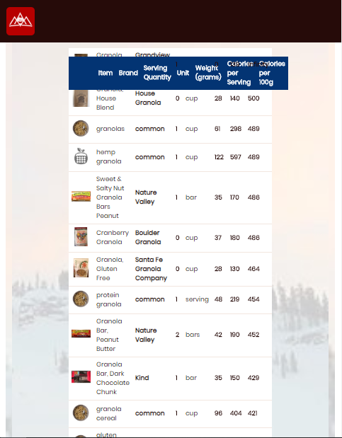

# ultraYumm

ultraYumm helps users select high energy and low weight foods for long distance hiking and packing. 

## Motivation

Current food and menu planning apps are focused on weight loss and/or calorie minimization. None are specifically designed to assist with long term planning for users seeking maximum energy and ultra-light packing.

## Current Early Stage Features

- Search for any food or brand name
- Results are ranked by highest calorie per 100gram ratio
- Filter results to see branded foods only
- Print results
- Add more items to existing search
- Clear search and start over

## Screenshots

## Future Development

This a very very basic prototype! Planned user functionnality includes the following:

- Push selected food to your own pack for trip planning
- Add custom foods and items to my pack
- Scan UPC codes to add to my pack
- Plan daily menus based on variable caloric needs
- Save and share trips and associated packs
- Purchase selected foods online
- See other nutritional information such as nutrients, minerals,  protein and fat values

## Built With
- HTM, JS, CSS & JQuery

## Author
Stephanie LeBlond
email: smaleblond@gmail.com
cell: 310-989-7801

## Contributors Wanted!
Pull requests are welcome. Please aso share your feedback and suggestions.

## Demo
https://ultrayumm.github.io/ultraYumm-App/

